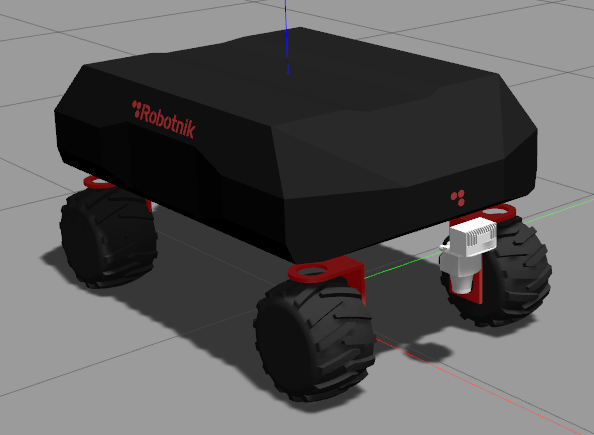
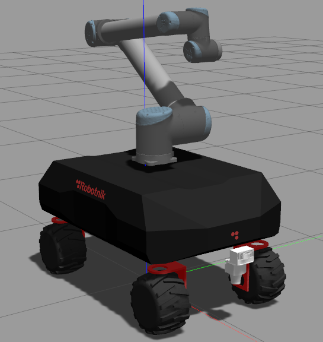
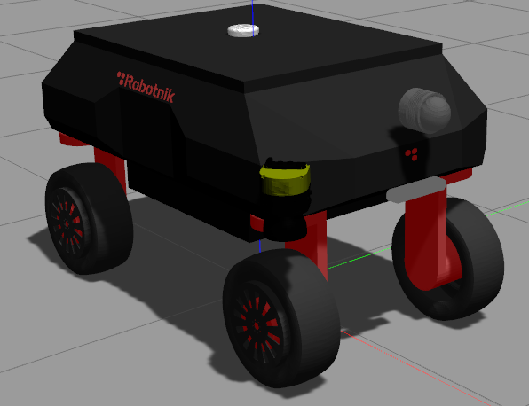
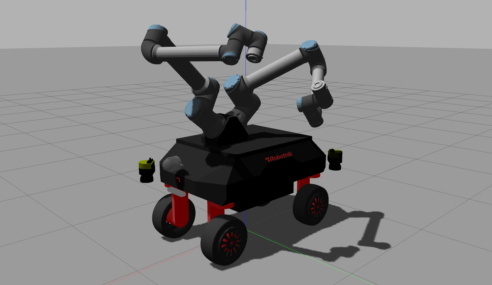
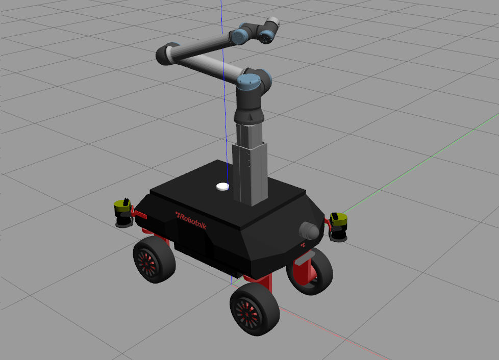
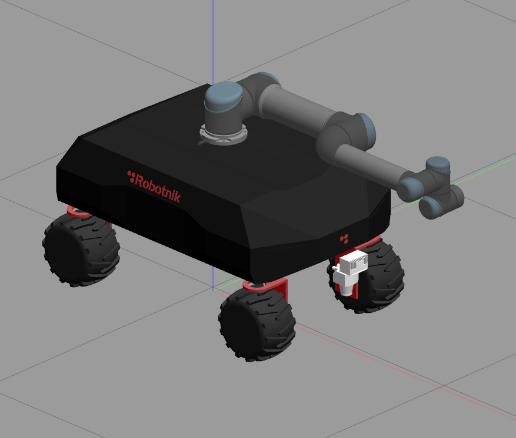
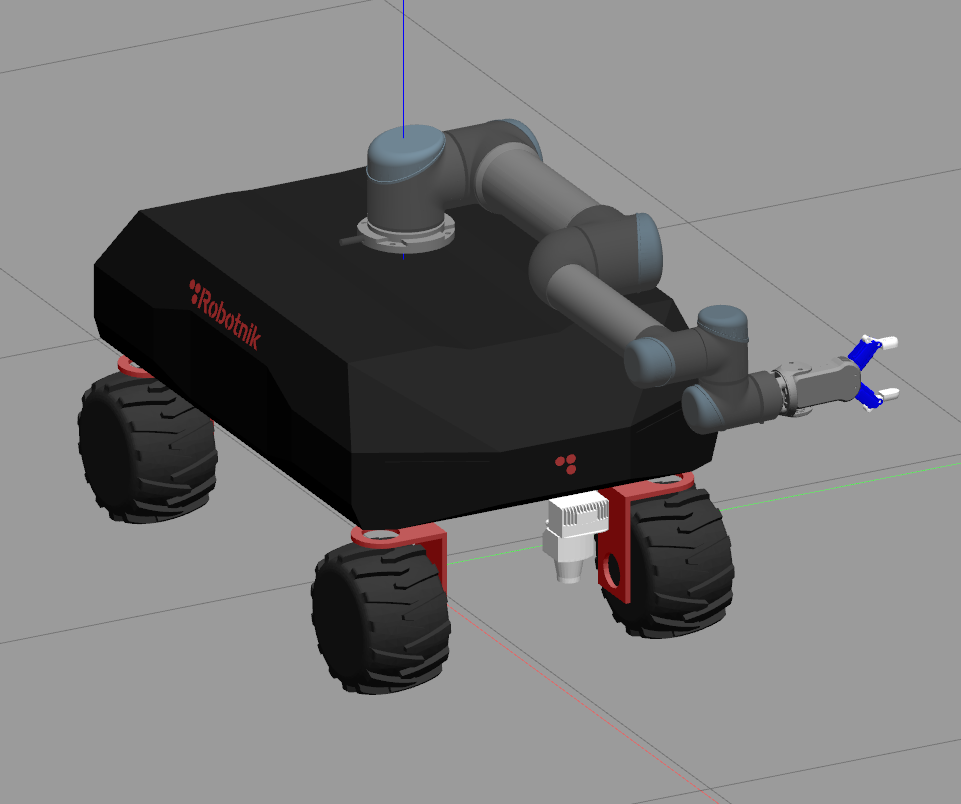
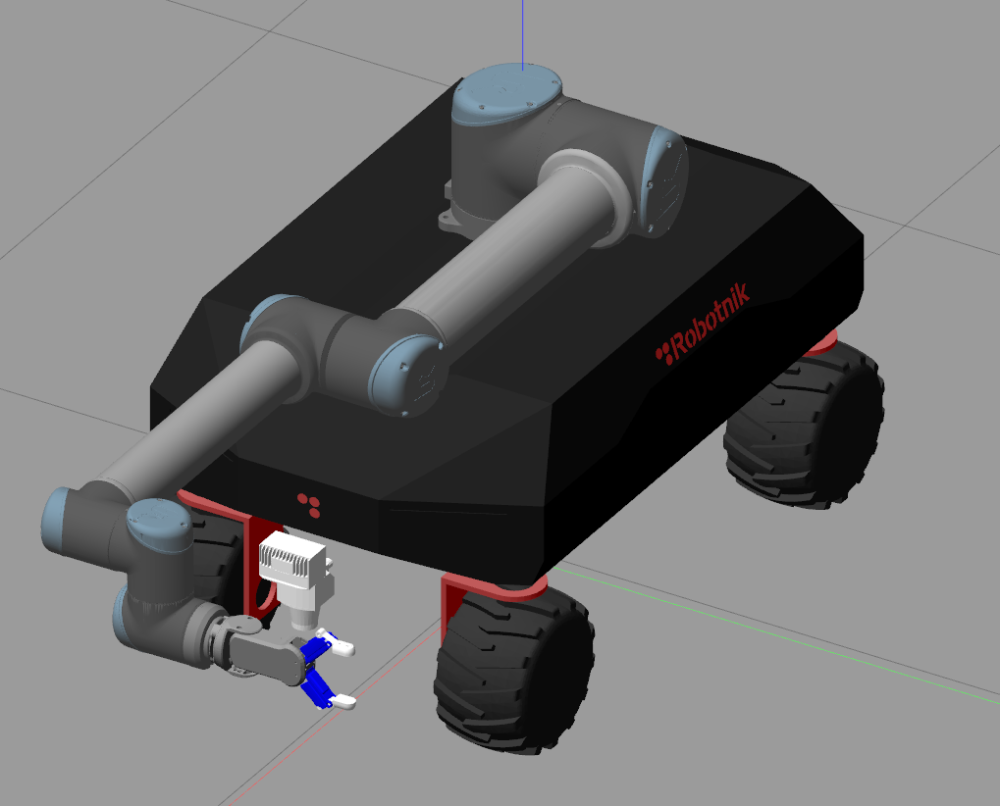
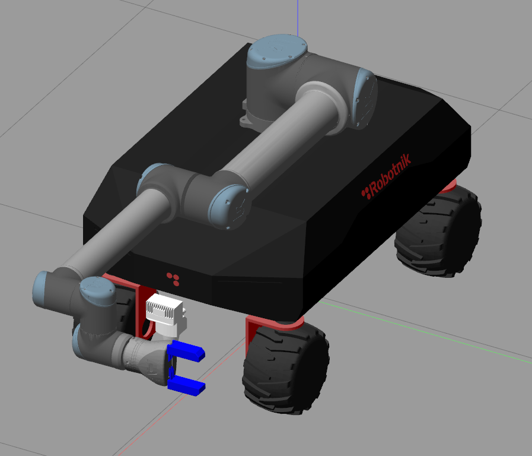

# rbvogui_sim

Packages for the simulation of the RB-Vogui

<p align="center">
  
  
  
  
  
</p>

## Packages

This packages contains: 

### rbvogui_gazebo

Launch files and world files to start the models in gazebo

### rbvogui_sim_bringup

Launch files that execute the complete simulation of the robot

## Requirements

- Ubuntu 18.04
- ROS Melodic
- Python 2.7 or higher

## Simulating RB-Vogui

### 1) Install the following dependencies:

This simulation has been tested using Gazebo 9 version. To facilitate the installation you can use the ```vcstool```:

```bash
sudo apt-get install -y python3-vcstool
```

Install ```catkin_tools``` in order to compile the workspace

```bash
sudo sh -c 'echo "deb http://packages.ros.org/ros/ubuntu `lsb_release -sc` main" > /etc/apt/sources.list.d/ros-latest.list'
wget http://packages.ros.org/ros.key -O - | sudo apt-key add -
sudo apt-get update
sudo apt-get install python-catkin-tools
```

Install ```rqt_joint_trajectory_controller``` to move the arm joint by joint and ```moveit_commander``` to move it via script

```bash
sudo apt-get install ros-melodic-rqt-joint-trajectory-controller 
sudo apt-get install ros-melodic-moveit-commander
```

### 2) Create a workspace and clone the repository:

Create a new workspace

```bash
mkdir catkin_ws
cd catkin_ws
```

Install one of these versions. Keep in mind  that on the stable version the latest features may be not available.

**Install stable version:**

```bash
vcs import --input https://raw.githubusercontent.com/RobotnikAutomation/rbvogui_sim/melodic-devel/repos/rbvogui_sim.repos
rosdep install --from-paths src --ignore-src -y
``` 

**Or install developer version:**

```bash
vcs import --input https://raw.githubusercontent.com/RobotnikAutomation/rbvogui_sim/melodic-devel/repos/rbvogui_sim_devel.repos
rosdep install --from-paths src --ignore-src -y
```

### 3) Install the controllers, robotnik_msgs and the rcomponent:


```bash
cd ~/catkin_ws
sudo dpkg -i src/rbvogui_common/libraries/*
```

### 4) Compile:

```bash
cd ~/catkin_ws
catkin build
source devel/setup.bash
```

### 5) Run RB-Vogui simulation:

These are the different configurations available:

- Vogui
- Vogui with UR-5 arm
- Vogui with UR-5 arm and RG2 gripper
- Vogui with UR-10 arm
- Vogui with UR-10 arm and RG2 gripper
- Vogui with UR-10 arm and EGH gripper
- Vogui XL
- Vogui XL with left and right UR10e arm
- Vogui XL with UR-10e arm and Ewellix lift

### 5.1 RB-Vogui

Set your robot kinematics to omni/ackermann (In case of ackermann, you will need twist2ackermann node enabled)
  
```bash
roslaunch rbvogui_sim_bringup rbvogui_complete.launch robot_model:=rbvogui
```
<p align="center">
  
</p>

### 5.2 RB-Vogui with UR5 arm

```bash
  roslaunch rbvogui_sim_bringup rbvogui_complete.launch robot_model:=rbvogui robot_xacro:=rbvogui_std_ur5.urdf.xacro launch_arm:=true arm_manufacturer:=ur arm_model:=ur5
```

<p align="center">
  
</p>

```bash
 ROS_NAMESPACE=robot roslaunch rbvogui_ur5_moveit demo.launch
```

### 5.3 RB-Vogui with UR5 arm and RG2 gripper

```bash
  roslaunch rbvogui_sim_bringup rbvogui_complete.launch robot_model:=rbvogui robot_xacro:=rbvogui_std_ur5_rg2.urdf.xacro launch_arm:=true arm_manufacturer:=ur arm_model:=ur5 launch_gripper:=true gripper_manufacturer:=onrobot gripper_model:=rg2
```

<p align="center">
  
</p>

```bash
ROS_NAMESPACE=robot roslaunch rbvogui_ur5_rg2_moveit demo.launch
```

### 5.4 RB-Vogui with UR10 arm

In case you want to launch the rbvogui with an UR arm you can type the following command:
```bash
  roslaunch rbvogui_sim_bringup rbvogui_complete.launch robot_model:=rbvogui robot_xacro:=rbvogui_std_ur10.urdf.xacro launch_arm:=true arm_manufacturer:=ur arm_model:=ur10
```

<p align="center">
  
</p>

You can play with the arm by using the rqt_joint_trajectory:
```bash
ROS_NAMESPACE=robot rosrun rqt_joint_trajectory_controller rqt_joint_trajectory_controller
```

Or even use moveit to plan trajectories:
```bash
ROS_NAMESPACE=robot roslaunch rbvogui_moveit_ur10 demo.launch
```

### 5.5 RB-Vogui with UR10 arm and RG2 gripper

```bash
  roslaunch rbvogui_sim_bringup rbvogui_complete.launch robot_model:=rbvogui robot_xacro:=rbvogui_std_ur10_rg2.urdf.xacro launch_arm:=true arm_manufacturer:=ur arm_model:=ur10 launch_gripper:=true gripper_manufacturer:=onrobot gripper_model:=rg2
```
<p align="center">
  
</p>


```bash
ROS_NAMESPACE=robot roslaunch rbvogui_ur10_rg2_moveit demo.launch
```

### 5.6 RB-Vogui with UR10 arm and EGH gripper

```bash
  roslaunch rbvogui_sim_bringup rbvogui_complete.launch robot_model:=rbvogui robot_xacro:=rbvogui_std_ur10_egh.urdf.xacro launch_arm:=true arm_manufacturer:=ur arm_model:=ur10 launch_gripper:=true gripper_manufacturer:=schunk gripper_model:=egh
```

<p align="center">
  
</p>

```bash
ROS_NAMESPACE=robot roslaunch rbvogui_ur10_egh_moveit demo.launch
```

### 5.7 RB-Vogui XL

If you prefer to launch the rbvogui XL, you can type:
```bash
roslaunch rbvogui_sim_bringup rbvogui_complete.launch robot_model:=rbvogui_xl robot_xacro:=rbvogui_xl_std.urdf.xacro
```

<p align="center">
  
</p>

### 5.8 RB-Vogui XL with two UR10e arm

The rbvogui Xl can be launched with two UR arms, only this bi-arm (UR-10e) option is available:
```bash
roslaunch rbvogui_sim_bringup rbvogui_complete.launch robot_model:=rbvogui_xl robot_xacro:=rbvogui_xl_std.urdf.xacro launch_arm:=true arm_manufacturer:=ur arm_model:=bi_ur10e
``` 

<p align="center">
  
</p>


You can play with the arms by using the rqt_joint_trajectory:
```bash
ROS_NAMESPACE=robot rosrun rqt_joint_trajectory_controller rqt_joint_trajectory_controller
```

To plan trajectories with the bi-arm robot you can type:

```bash
ROS_NAMESPACE=robot roslaunch rbvogui_xl_2ur10_e_moveit rbvogui_xl_moveit_config.launch
```

To switch between arms on RViz look for MotionPlanning > Planning Request > Planning Group and it will show you all the available groups (left_arm and right_arm).

### 5.9 RB-Vogui XL with UR10e arm and Ewellix lift

The rbvogui Xl can also be launched with an UR-10e arm and an Ewellix lift:


```bash
roslaunch rbvogui_sim_bringup rbvogui_complete.launch robot_model:=rbvogui_xl robot_xacro:=rbvogui_xl_lift_ur10e.urdf.xacro launch_arm:=true arm_manufacturer:=ur arm_model:=lift_ur10e
``` 

<p align="center">
  
</p>

You can play with the arm by using the rqt_joint_trajectory:
```bash
ROS_NAMESPACE=robot rosrun rqt_joint_trajectory_controller rqt_joint_trajectory_controller
```

To plan trajectories with the robot you can type:

```bash
ROS_NAMESPACE=robot roslaunch rbvogui_xl_lift_ur10e_moveit demo.launch
```

To control the lift, you can type:

```bash
rostopic pub /robot/lift_controller/command std_msgs/Float64 "data: 0.2"
```

<!-- 
### 6) Enjoy!

You can use the topic ```/robot/robotnik_base_control/cmd_vel ``` to control the RB-Vogui robot. -->

## Mappping, localization and navigation

You can use these features with any of the above configurations of the robot. **Just add the following parameters to the robot:**

Param | Type | Description | Requirements
------------ | -------------  | ------------- | -------------
run_mapping | Boolean  | Launch gmapping mapping | Localization must be running
run_localization | Boolean  | Launch amcl localization. | Mapping can not be running
map | String | Set the map for localization | Format: map_folder/map_name.yaml
run_navigation | Boolean  | Launch TEB navigation | Localization must be running

### 1. Create a map

Launch rbvogui robot with gmapping:

```bash
roslaunch rbvogui_sim_bringup rbvogui_complete.launch robot_model:=rbvogui robot_xacro:=rbvogui_std.urdf.xacro run_localization:=true run_navigation:=true
```

When the map is fine, open a terminal and go to the ```rbvogui_localization``` package

```bash
cd ~/catkin_ws && source devel/setup.bash
roscd rbvogui_localization && cd maps
```

Create a folder with the name of the map. For example:

``` bash
mkdir demo_map
cd demo_map
```

Finally, save the map inside that folder

```bash
ROS_NAMESPACE=robot rosrun map_server map_saver -f demo_map
```


### 2. Use a map

Navigate with the rbvogui_xl using the default map:

```bash
roslaunch rbvogui_sim_bringup rbvogui_complete.launch robot_model:=rbvogui_xl robot_xacro:=rbvogui_xl_std.urdf.xacro run_localization:=true run_navigation:=true
```

Or use your own map:

```bash
roslaunch rbvogui_sim_bringup rbvogui_complete.launch robot_model:=rbvogui_xl robot_xacro:=rbvogui_xl_std.urdf.xacro run_localization:=true run_navigation:=true map:=demo_map/demo_map.yaml
```

### 3. Troubleshooting

### 3.1  Laser visualization

If the laser does not display via RVIZ is probably because the computer does not use the GPU. You can disable the GPU for the rbvogui simulation. Just add this parameter to the robot:

```bash
roslaunch rbvogui_sim_bringup rbvogui_complete.launch robot_model:=rbvogui use_gpu:=false
```

## Examples

**Disclaimer**: **these examples have only been tested in the simulation. They work with the real robot but have been simplificated, therefore the security is not managed. For the real robot you must use the robot_local_control package.**

The robot can be commanded from a script via the standard ROS interface like move_base or moveit_commander.

### 1. Move robot script

Launch the robot, localization and navigation

```bash
roslaunch rbvogui_sim_bringup rbvogui_complete.launch robot_model:=rbvogui run_localization:=true run_navigation:=true
```

Then, run the script. The robot will move to (1,1) position

```bash
ROS_NAMESPACE=robot rosrun rbvogui_gazebo move_robot.py
```

You can set your own position by editing the script:

```bash
point.target_pose.pose.position.x = 1.0
point.target_pose.pose.position.y = 1.0
point.target_pose.pose.position.z = 0.0
```

### 2. Move arm script

Launch the robot with the arm:
```bash
  roslaunch rbvogui_sim_bringup rbvogui_complete.launch robot_model:=rbvogui robot_xacro:=rbvogui_std_ur10.urdf.xacro launch_arm:=true arm_manufacturer:=ur arm_model:=ur10
```

Launch moveit:
```bash
ROS_NAMESPACE=robot roslaunch rbvogui_moveit_ur10 demo.launch
```

Then run one of these scripts:

#### Joint by joint 

It moves the arm joint by joint

```bash
ROS_NAMESPACE=robot rosrun rbvogui_gazebo move_arm_joint_by_joint.py
```

You can set your own joints positions by editing the script:

```bash
joint_goal[0] = 0
joint_goal[1] = -pi/4
joint_goal[2] = 0
joint_goal[3] = -pi/2
joint_goal[4] = 0
joint_goal[5] = pi/3
```

#### To point

It moves the arm to a point

```bash
ROS_NAMESPACE=robot rosrun rbvogui_gazebo move_arm_to_point.py
```

You can set your own point by editing the script:
```bash
pose_goal.orientation.w = 1.0
pose_goal.position.x = 0.7
pose_goal.position.y = 0.4
pose_goal.position.z = 1.5
```

## Pad teleoperation

The robot can be controlled with a ps4 controller using the ```robotnik_pad``` package. It reads from the IMU of the ps4 and it is able to stop the robot safetly when the connection is lost. 

### 1. Installation

The standard linux driver for ps4 driver cannot give IMU data, therfeore we need the ds4drv driver.

Install the ds4drv pip script

```bash
sudo pip install ds4drv
```

Install PS4 controller config for ds4drv
```bash
cd /etc && sudo wget https://raw.githubusercontent.com/RobotnikAutomation/robotnik_pad/master/ds4drv.conf
```

Add the udev rules for PS4 controller
```bash
cd && sudo echo 'KERNEL=="js[0-9]*", SUBSYSTEM=="input", SYMLINK+="input/js_base", ATTRS{name}=="Sony Computer Entertainment Wireless Controller"' >> /etc/udev/rules.d/55-ds4drv.rules
```

Enable the execution of the ds4drv service on boot:

```bash
sudo systemctl daemon-reload
sudo systemctl enable ds4drv.service
sudo systemctl start ds4drv.service
```

### 2. Pairing 

Pair the PS4 controller to your computer via bluetooth

When the connection is done you can check if the data is receiving

```bash
cd /dev/input
jstest js_base
```

Data must be constantly updated, otherwise something is wrong.

### 3. Usage

Param | Type | Description | Requirements
------------ | -------------  | ------------- | -------------
launch_pad | boolean  | It launches the robotnik_pad packages | ds4drv installed, ps4 controller, bluetooth connection

In order to use the pad on the simulation add the parameter ```launch_pad:=true```

```bash
roslaunch rbvogui_sim_bringup rbvogui_complete.launch robot_model:=rbvogui launch_pad:=true
```

## Docker usage

In order to run this simulation you will need nvidia graphical accelation

### Installation of required files
- [docker](https://docs.docker.com/engine/install/ubuntu/)
- [nvidia-docker](https://docs.nvidia.com/datacenter/cloud-native/container-toolkit/install-guide.html#docker)
- nvidia-drivers

### Usage

```bash
git clone https://github.com/RobotnikAutomation/rbvogui_sim.git
cd rbvogui_sim
git checkout melodic-devel
docker/simulation-in-container-run.sh

```

#### Selecting the robot model

You can select the robot, the launch file of package using the optional arguments on launch
By default the selected robot is `rbvogui`

```bash
docker/simulation-in-container-run.sh --help
```

```
ROBOTNIK AUTOMATION S.L.L. 2021

Simulation of RB VOGUI using docker

Usage:
docker/simulation-in-container-run.sh [OPTIONS]

Optional arguments:
 --robot -r ROBOT       Select robot to simulate
                        Valid robots:
                            rb_vogui_one_ur_arm rb_vogui_xl_two_ur_arms rb_vogui rb_vogui_xl
                        default: rb_vogui

 --launch -l            Select launch file
                        default: rbvogui_complete.launch kinematics:=omni twist2ackermann:=false

 --package -p           Select ros package
                        default: rbvogui_sim_bringup

 --ros-port -u PORT     Host ros port
                        default: 11345

 --gazebo-port -g PORT  Host ros port
                        default: 11345

 -h, --help             Shows this help

```

**RB Vogui with one UR arm**
```bash
docker/simulation-in-container-run.sh --robot rb_vogui_one_ur_arm
```
***IMPORTANT:*** This simulation starts paused, please remember to press play button on gazebo after few seconds

**RB Vogui XL**
```bash
docker/simulation-in-container-run.sh --robot rb_vogui_xl
```
***IMPORTANT:*** This simulation starts paused, please remember to press play button on gazebo after few seconds

**RB Vogui XL with UR arms**
```bash
docker/simulation-in-container-run.sh --robot rb_vogui_xl_two_ur_arms
```
***IMPORTANT:*** This simulation starts paused, please remember to press play button on gazebo after few seconds

#### Manual Build

If you wish to build manually the image without the use of the script use one the following commands:

**Optiona A**
```bash
cd docker
docker build -f Dockerfile ..
```
**Option B**
```bash
docker build -f docker/Dockerfile .
```

#### Notes

- This is docker requires a graphical interface
- The ros master uri is accesible outside the container, so in the host any ros command should work
- You could also run a roscore previous to launch the simulation in order to have some processes on the host running
- if you want to enter on the container use the following command in another terminal
```bash
docker container exec -it rb_vogui_sim_instance bash
```
- In order to exit you have to 2 options
1. Close `gazebo` and `rviz` and wait a bit
2. execute in another terminal:
```bash
docker container rm --force rb_vogui_sim_instance
```