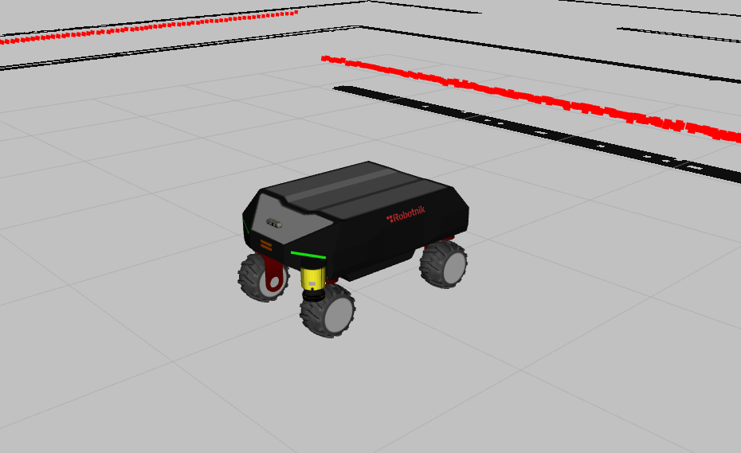
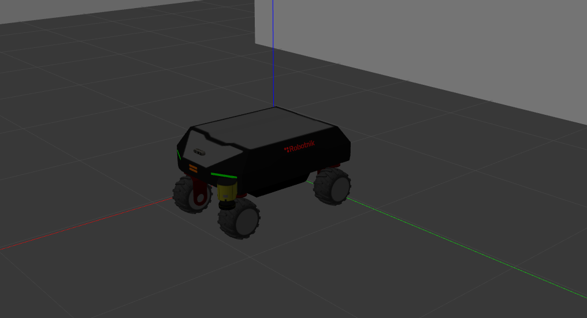
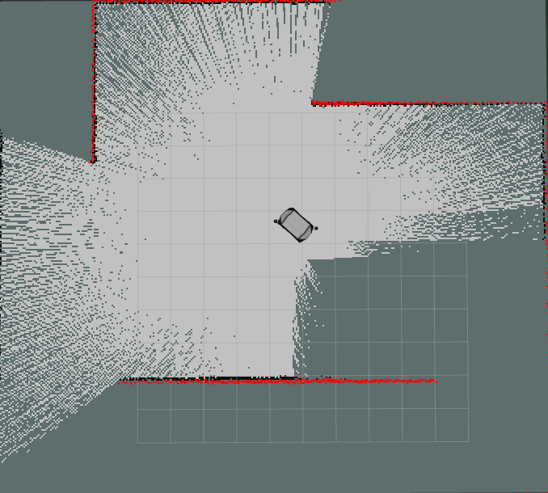
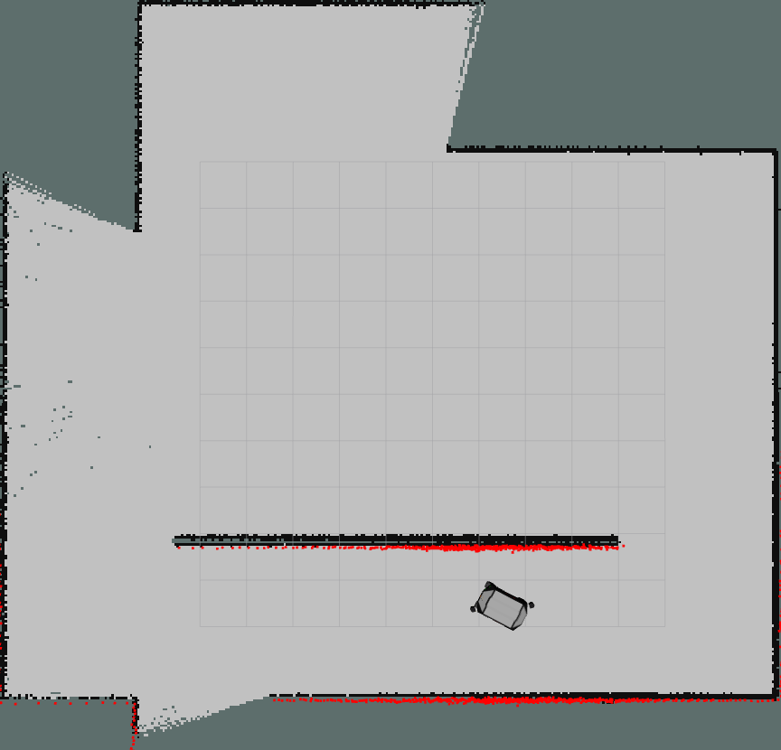
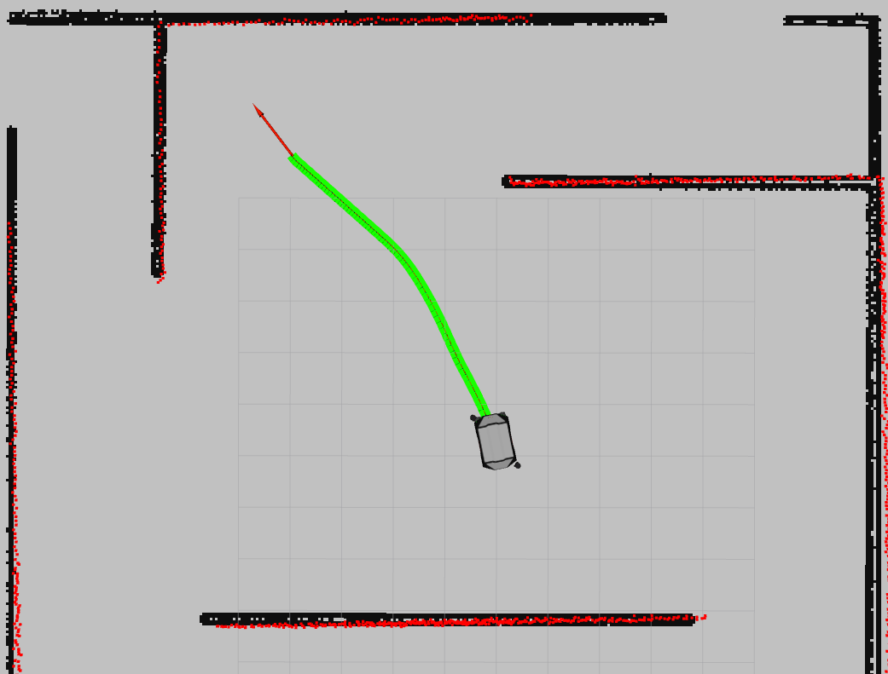

# rbvogui_sim

Packages for the simulation of the RB-Vogui

<p align="center">
  
  
</p>

## Packages

This packages contains the simulation of the RB-Vogui in ROS2 Humble, using Gazebo 11 as simulator.

### rbvogui_gazebo

Launch files and world files to start the models in gazebo.

## Requirements

- Ubuntu 22.04
- ROS Humble

## Simulating RB-Vogui

### 1) Install the following dependencies:

This simulation has been tested using Gazebo 11 version. First, install de following dependencies:
```bash
sudo apt-get install ros-humble-gazebo-ros
sudo apt-get install ros-humble-control-msgs
sudo apt-get install ros-humble-control-toolbox
sudo apt-get install ros-humble-controller-interface
sudo apt-get install ros-humble-controller-manager
sudo apt-get install ros-humble-joint-state-broadcaster
sudo apt-get install ros-humble-ros-gz
sudo apt-get install ros-humble-gazebo-ros-pkgs
sudo apt-get install ros-humble-ros2-control
sudo apt-get install ros-humble-gazebo-ros2-control
sudo apt-get install ros-humble-velodyne-gazebo-plugins
sudo apt-get install ros-humble-opennav-docking
sudo apt-get install ros-humble-slam-toolbox
sudo apt-get install ros-humble-teleop-twist-keyboard
```

### 2) Create a workspace and clone the repository:

Create a new workspace

```bash
mkdir -p ros2_ws/src
cd ros2_ws/src
```

Then, install this repository in your workspace:
```bash
git clone -b humble-devel https://github.com/RobotnikAutomation/rbvogui_sim
git clone -b humble-devel https://github.com/RobotnikAutomation/rbvogui_common
```

Also, the repository for the realsense in gazebo:
```bash
git clone -b foxy-devel https://github.com/pal-robotics/realsense_gazebo_plugin.git
```

### 3) Install the controllers, robotnik_msgs and the rest of debs:

```bash
sudo dpkg -i ~/ros2_ws/src/rbvogui_common/rbvogui_common/debs/ros-humble-*.deb
```

### 4) Compile:

```bash
cd ~/ros2_ws
colcon build --symlink-install
source install/setup.bash
```

### 5) Run RB-Vogui simulation:


```bash
ros2 launch rbvogui_gazebo spawn_simulation.launch.py
```

With this launch, the simulation in gazebo will start. The arguments of the launch are:

  1. namespace: Namespace of the node. default: robot
  2. robot_id: Name of the robot. default: robot
  3. kinematics: Kinematics of the robot (omni or ackermann). default: omni

Examples:
```bash
ros2 launch rbvogui_gazebo spawn_simulation.launch.py namespace:=project_a
ros2 launch rbvogui_gazebo spawn_simulation.launch.py robot_id:=robot_a
ros2 launch rbvogui_gazebo spawn_simulation.launch.py robot_id:=robot_b kinematics:=ackermann
```

Now you can controll the robot in the simulation, try to send some velocity commands:
```bash
ros2 run teleop_twist_keyboard teleop_twist_keyboard --ros-arg cmd_vel:=/robot/robotnik_base_controller/cmd_vel
```

The package rbvogui_common has all the packages of the RB-Vogui robot:
- description
- mapping
- localization
- navigation
- docking

### 5.2 Mapping

To launch the mapping use the following command:
```bash
ros2 launch rbvogui_navigation mapping.launch.py
```

Move the robot around the map until you see a good result of a map in rviz2. I recommend to use the previous command to move the robot:
```bash
ros2 run teleop_twist_keyboard teleop_twist_keyboard --ros-arg cmd_vel:=/robot/robotnik_base_controller/cmd_vel
```

Once you see a good result of the map, save it:
```bash
ros2 service call /robot/slam_toolbox/save_map slam_toolbox/srv/SaveMap "name:
  data: '~/ros2_ws/src/rbvogui_common/rbvogui_navigation/maps/name'"
```


<p align="center">
  
  
</p>

### 5.2 Localization

To launch the localization use the following command:
```bash
ros2 launch rbvogui_navigation map_server.launch.py
```

By default the map of the default world is already set, but if you want to use another one, use the param *map_name* to launch the localization with the map with that name.

```bash
ros2 launch rbvogui_navigation map_server.launch.py map_name:=map
```

or use the *map_file_abs*, specifying the absolute path:

```bash
ros2 launch rbvogui_navigation map_server.launch.py map_file_abs:=~/ros2_ws/src/rbvogui_common/rbvogui_navigation/maps/map.yaml
```

also, the params for the AMCL algorithm are already configured but can be changed by the param *amcl_file*, specifying the absolute path:

```bash
ros2 launch rbvogui_navigation map_server.launch.py amcl_file:=~/ros2_ws/src/rbvogui_common/rbvogui_navigation/config/amcl.yaml
```

Other params:
- namespace
- robot_id
- map_frame_id

### 5.3 Navigation (On Work)

In the case of the navigation, there are 2 configurations depending on the kinematics of the robot. By default is set to use the omni navigation.


<p align="center">
  
</p>

```bash
ros2 launch rbvogui_navigation navigation.launch.py
```

or for ackermann: 

```bash
ros2 launch rbvogui_navigation navigation.launch.py kinematics:=ackermann
```

or directly a navigation file:

```bash
ros2 launch rbvogui_navigation navigation.launch.py nav_config_file:=~/ros2_ws/src/rbvogui_common/rbvogui_navigation/config/nav_ackermann.yaml
```

To navigate, send goals using the 2D Goal Pose in rviz2.

Explain of the configuration in [Nav2 docs](https://docs.nav2.org/configuration/index.html).

### 5.4 Docking (On Work)

For the docking, the RB-Vogui uses the Nav2 docking.

```bash
sudo apt-get install ros-humble-opennav-docking
```
To launch everything:

```bash
ros2 launch rbvogui_docking rbvogui_docking.launch.py
```

This will send a fixed pose respect to odom frame, it can be modified frome the launch file.

Call the docking by the action:

```bash
ros2 action send_goal /robot/dock_robot opennav_docking_msgs/action/DockRobot "use_dock_id: true
dock_id: 'home_dock'
dock_pose:
  header:
    stamp:
      sec: 0
      nanosec: 0
    frame_id: ''
  pose:
    position:
      x: 0.0
      y: 0.0
      z: 0.0
    orientation:
      x: 0.0
      y: 0.0
      z: 0.0
      w: 1.0
dock_type: ''
max_staging_time: 1000.0
navigate_to_staging_pose: false" 

```

Explain of the configuration and ros2 action in [Nav2 docking docs](https://docs.nav2.org/tutorials/docs/using_docking.html).
